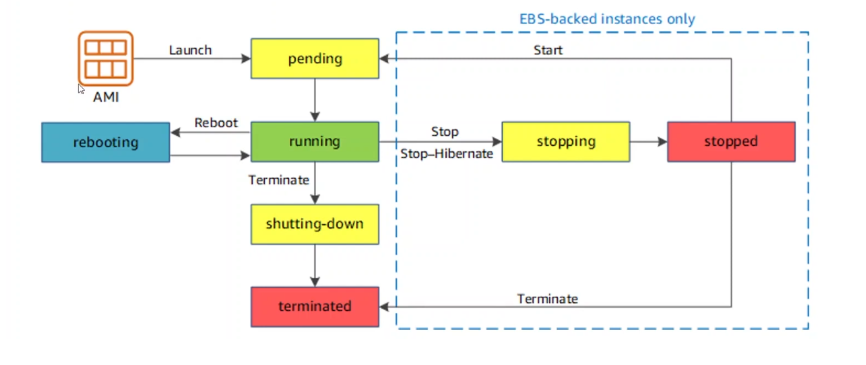
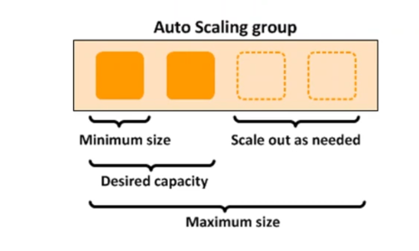
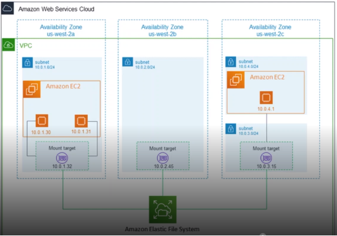

# RELATÓRIO DE IMPLEMENTAÇÃO DE SERVIÇOS AWS

Data: 24/02/2024

Empresa: Abstergo Industries 

Responsável: Emílio Lucio Borges

## Introdução
Este relatório apresenta o processo de implementação de ferramentas na empresa Abstergo Industries, realizado por Emílio Lucio Borges. O objetivo do projeto foi elencar 3 serviços AWS, com a finalidade de realizar diminuição de custos imediatos.

## Descrição do Projeto
O projeto de implementação de ferramentas foi dividido em 3 etapas, cada uma com seus objetivos específicos. A seguir, serão descritas as etapas do projeto:

Etapa 1: 
- Elastic Compute Cloud - EC2
- Capacidade computacional segura e redimensionável(você pode escolher uma instância(computador) com as configurações de acordo com a sua necessidade) instâncias otimizadas para sua atividade onde o preço e definido de acordo com o uso
- Neste caso seria usado um tipo de instância Otimizada para armazenamento, devido ao fato da empresa ter uma grande quantidade de produtos cadastrados e também realiza transações online, a instância informada e ideal, pois trabalha com cargas de trabalho que exigem acesso de leitura e gravação com grandes volumes de dados. Para este tipo de serviço teremos um redução com gastos relacionados Servidores, Armazenamento, Sistema Operacional, Redes e caso precise aumentar a capacidade operacional, e possivel fazer de forma rapida direto do site da AWS.

Etapa 2: 
- Amazon EC2 AutoScaling
- Melhorar a escalabilidade da Instância
- E um sistema que faz com que a instância seja direcionada para os dias, horarios nos quais a demanda de acesso ao site da empresa e maior e reduzindo nos dias, horarios com a demanda menor. Em casos onde uma instância não e capaz de atender uma segunda instância pré configura fica online para auxiliar no aumento da demanda. Onde e possivel implatar uma instância em mais de um região por exemplo um multi-AZ para evitar falhas caso alguma instância fique offline por algum motivo. Neste modelo temos um melhor gerenciamento de custos

Etapa 3: 
- EFS - Amazon Elastic Fire System
- Armazenamento de Dados
- E um sistema de banco de dados totalmente gerenciavel, compativel com a Ferramenta EC2. Acesso simultâneo aos mesmos dados sem problemas de performance

## Conclusão
A implementação de ferramentas na empresa Abstergo Industries tem como esperado reddução nos custos relacionados a compra e manutenção de equipamentos, manutenção com rede e banco de dandos, onde também não será preciso manter uma sala refrigerada para manter o servidor e os de mais equipamentos, onde e possivel ter um controle de gastos, uma outras instância que pode ficar configuradas e prontas para serem usadas em outras regiões que pode ficar online caso tenha uma aumenta da demanda e apenas uma instância não seja capaz de atender ou caso essa instância tenha algum problema e para de funcionar uma outra ficaria online fazendo o papel da anterior o que aumentará a eficiência e a produtividade da empresa. Recomenda-se a continuidade da utilização das ferramentas implementadas e a busca por novas tecnologias que possam melhorar ainda mais os processos da empresa.

## Anexos
### Ciclo de vida de uma instância EC2

### Configuração de uma Auto Scaling

### Exemplo de uma instância Amazon Elastic File System

Assinatura do Responsável pelo Projeto:

Emílio Lucio Borges